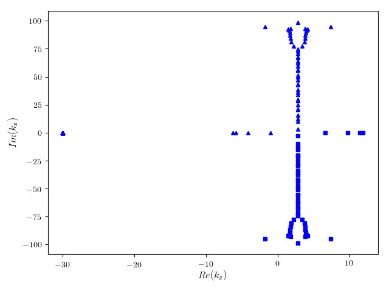
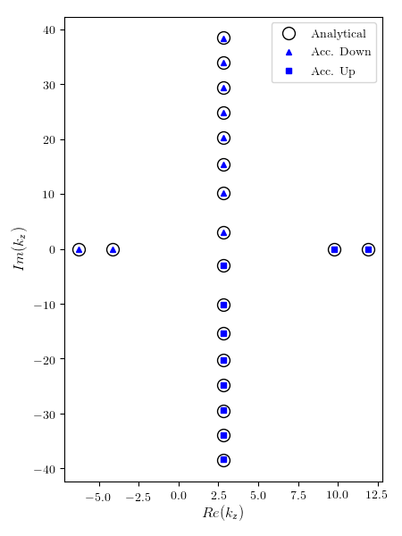
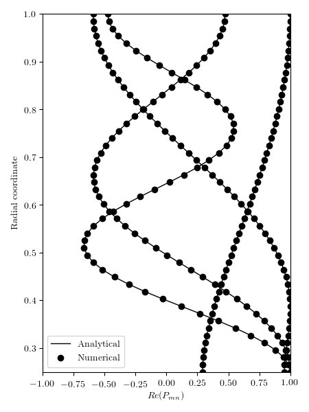

# noisyduck

[](https://badge.fury.io/py/noisyduck)
[](https://travis-ci.org/nwukie/noisyduck)
[](https://noisyduck.readthedocs.io/en/latest/?badge=latest)
[](LICENSE.rst)


A python tool for computing eigenmode decompositions of duct flows.

## Features

* Annular duct mode decompositions
    * Acoustic mode analyses
    * Nonreflecting boundary conditions


## Installing via pip
```bash
> pip install noisyduck
```

## Examples
One application of **noisyduck** is for the eigen-decomposition of a uniform axial mean flow
in a cylindrical annulus. This is detailed in [Tutorial 1](tutorials/Tutorial1.ipynb) and the
results of this are shown here as an example.

  

## Tutorials
A collection of [Tutorials](tutorials/README.md) is being assembled, which we will add to as applications and
capabilities progress. 

## Documentation
[Documentation](https://noisyduck.readthedocs.io) is built using Sphinx and hosted on ReadTheDocs.

## Credits

This package was created with [Cookiecutter](https://github.com/audreyr/cookiecutter) and the [`audreyr/cookiecutter-pypackage`](https://github.com/audreyr/cookiecutter-pypackage) project template.

